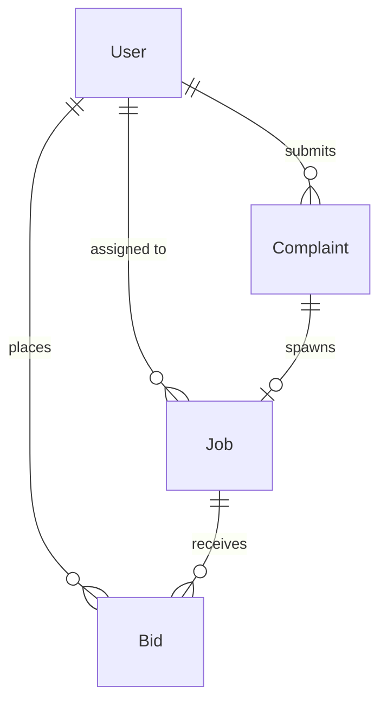
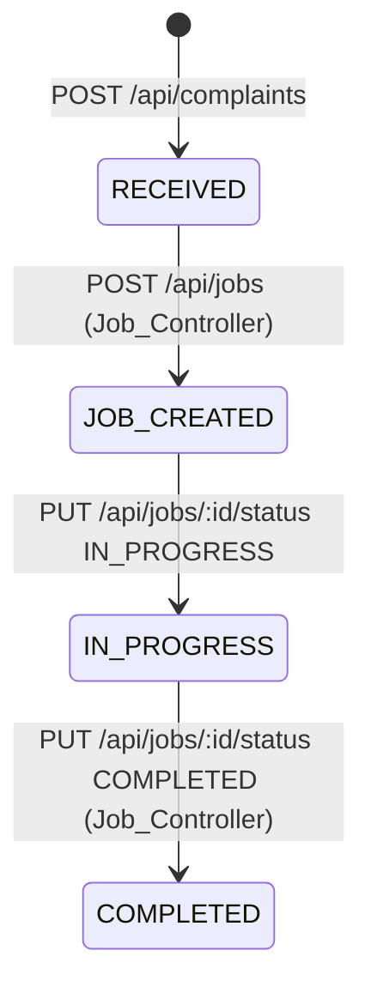
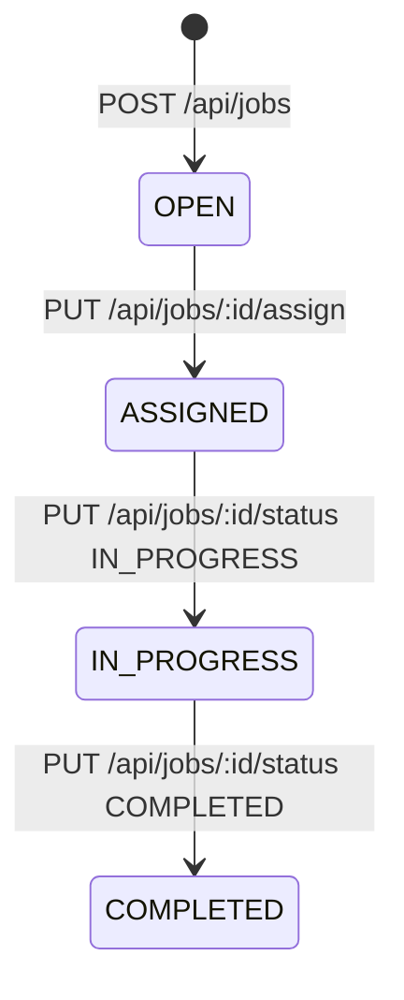
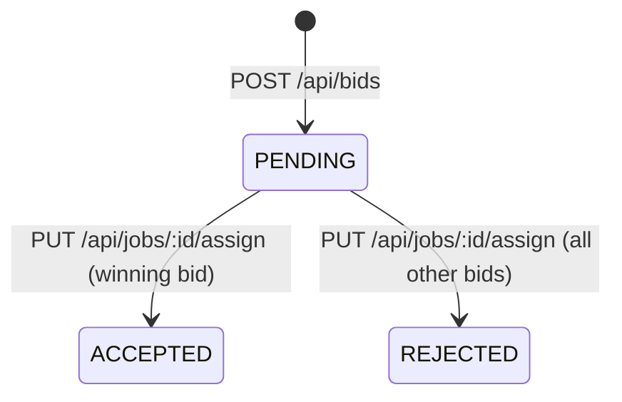
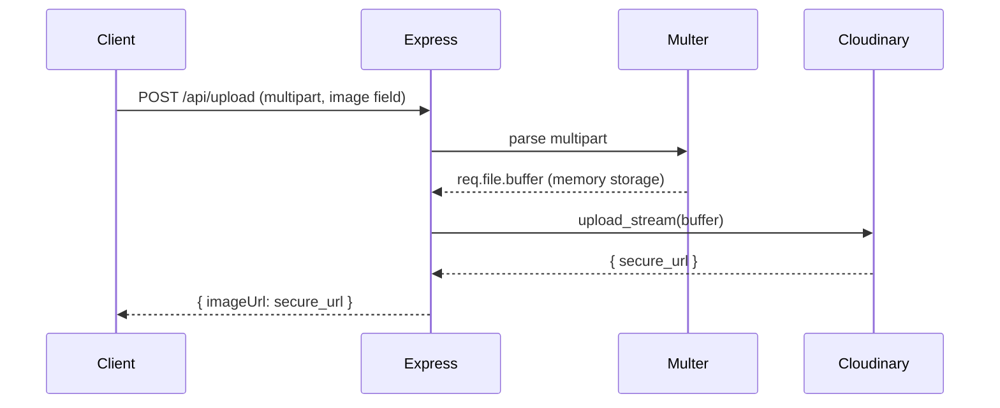

# Design Document — fixmycity-backend

## Overview

FixMyCity is a civic issue reporting and management platform. The backend is a Node.js/Express API (ESM modules) backed by MongoDB Atlas via Mongoose. Three clients consume it: a Citizen mobile app (submits complaints), an Authority Dashboard (admin web app — React/TypeScript/Vite), and a Contractor Dashboard (bids and job updates).

This design covers:
- Completing the backend (package.json, Job/Bid models, controllers, routes, Complaint model fields)
- Wiring the Authority Dashboard frontend to real API data (replacing mock data)
- Upload flow via multer memory storage → Cloudinary
- Status lifecycle synchronisation between Complaint and Job documents

### Key Design Decisions

- **ESM modules throughout**: `"type": "module"` in package.json; all imports use `.js` extensions
- **Multer memory storage**: No files written to disk; buffer streamed directly to Cloudinary via `upload_stream`
- **Atomic status sync**: Job creation and completion update the linked Complaint in the same request handler — no separate endpoint needed
- **Single ACCEPTED bid invariant**: The assign endpoint rejects all other bids in the same handler using `updateMany`
- **JWT payload shape**: `{ id, role }` — already established by authController; all new controllers follow the same pattern

---

## Architecture

```mermaid
graph TD
    subgraph Clients
        CA[Citizen App]
        AD[Authority Dashboard]
        CD[Contractor Dashboard]
    end

    subgraph Backend ["Backend (Node/Express :5000)"]
        MW[Auth Middleware]
        AR[/api/auth]
        CR[/api/complaints]
        JR[/api/jobs]
        BR[/api/bids]
        UR[/api/upload]
    end

    subgraph DB [MongoDB Atlas]
        U[(Users)]
        C[(Complaints)]
        J[(Jobs)]
        B[(Bids)]
    end

    CLD[Cloudinary]

    CA -->|JWT| MW
    AD -->|JWT| MW
    CD -->|JWT| MW

    MW --> AR
    MW --> CR
    MW --> JR
    MW --> BR
    MW --> UR

    AR --> U
    CR --> C
    JR --> J
    JR -->|status sync| C
    BR --> B
    BR -->|bid reject| B
    UR -->|upload_stream| CLD
```

### Request Flow

1. Client sends request with `Authorization: Bearer <token>`
2. `protect` middleware verifies JWT, attaches `{ id, role }` to `req.user`
3. Route handler delegates to controller
4. Controller interacts with Mongoose models
5. Response returned as JSON

---

## Components and Interfaces

### Backend Directory Structure

```
backend/
├── package.json                  ← NEW
├── server.js                     ← UPDATE (add job/bid routes)
├── .env
├── config/
│   ├── db.js
│   └── cloudinary.js
├── middleware/
│   └── authMiddleware.js
├── models/
│   ├── User.js
│   ├── Complaint.js              ← UPDATE (add userId, severity, location)
│   ├── Job.js                    ← NEW
│   └── Bid.js                    ← NEW
├── controllers/
│   ├── authController.js
│   ├── complaintController.js    ← UPDATE (add getById, populate userId)
│   ├── jobController.js          ← NEW
│   ├── bidController.js          ← NEW
│   └── uploadController.js       ← NEW (extracted from uploadRoutes)
└── routes/
    ├── authRoutes.js
    ├── complaintRoutes.js        ← UPDATE (add GET /:id)
    ├── jobRoutes.js              ← NEW
    ├── bidRoutes.js              ← NEW
    └── uploadRoutes.js           ← UPDATE (use memory storage)
```

### Frontend Directory Structure (changes only)

```
src/
├── hooks/
│   ├── useComplaints.ts          ← UPDATE (add severity, location fields)
│   ├── useJobs.ts                ← NEW
│   └── useBids.ts                ← NEW
└── pages/
    ├── Complaints.tsx            ← UPDATE (real API, Create Job button)
    ├── Jobs.tsx                  ← UPDATE (real API, bid panel, assign)
    └── MapDashboard.tsx          ← UPDATE (useComplaints hook, real pins)
```

### API Route Table

| Method | Path | Auth | Description |
|--------|------|------|-------------|
| POST | `/api/auth/signup` | No | Register user |
| POST | `/api/auth/login` | No | Login, returns JWT |
| GET | `/api/complaints` | Yes | List all complaints (sorted desc) |
| POST | `/api/complaints` | Yes | Create complaint |
| GET | `/api/complaints/:id` | Yes | Get single complaint |
| PATCH | `/api/complaints/:id/status` | Yes | Update complaint status |
| GET | `/api/jobs` | Yes | List all jobs (sorted desc, populated) |
| POST | `/api/jobs` | Yes | Create job from complaint |
| GET | `/api/jobs/open` | Yes | List only OPEN jobs |
| PUT | `/api/jobs/:id/assign` | Yes | Assign contractor, accept/reject bids |
| PUT | `/api/jobs/:id/status` | Yes | Update job status |
| GET | `/api/bids/:jobId` | Yes | List bids for a job |
| POST | `/api/bids` | Yes | Create bid |
| POST | `/api/upload` | No | Upload image to Cloudinary |

---

## Data Models

### User

```js
{
  username: { type: String, required: true, unique: true },
  password: { type: String, required: true },          // bcrypt hash
  role:     { type: String, enum: ["CITIZEN","ADMIN","CONTRACTOR"], required: true }
}
```

### Complaint (updated)

```js
{
  userId:      { type: ObjectId, ref: "User", required: true },
  description: String,
  imageUrl:    String,
  category:    String,
  severity:    { type: String, enum: ["LOW","MEDIUM","HIGH"] },
  location: {
    lat:     Number,
    lng:     Number,
    address: String
  },
  status: {
    type: String,
    enum: ["RECEIVED","JOB_CREATED","IN_PROGRESS","COMPLETED"],
    default: "RECEIVED"
  },
  timestamps: true
}
```

### Job (new)

```js
{
  complaintId:  { type: ObjectId, ref: "Complaint", required: true },
  title:        { type: String, required: true },
  description:  String,
  category:     String,
  severity:     String,
  location: {
    lat:     Number,
    lng:     Number,
    address: String
  },
  status: {
    type: String,
    enum: ["OPEN","ASSIGNED","IN_PROGRESS","COMPLETED"],
    default: "OPEN"
  },
  assignedTo: { type: ObjectId, ref: "User" },
  timestamps: true
}
```

### Bid (new)

```js
{
  jobId:        { type: ObjectId, ref: "Job", required: true },
  contractorId: { type: ObjectId, ref: "User", required: true },
  eta:          String,
  cost:         Number,
  note:         String,
  status: {
    type: String,
    enum: ["PENDING","ACCEPTED","REJECTED"],
    default: "PENDING"
  },
  createdAt: { type: Date, default: Date.now }
}
```

### Model Relationships



---

## Status Lifecycle State Machines

### Complaint Status



Complaint status is **never updated directly by the client** after creation — it is always driven by Job lifecycle events.

### Job Status



### Bid Status



---

## Controller Logic

### complaintController.js (updates)

**createComplaint**: Set `userId` from `req.user.id`. Validate required fields. Default status `RECEIVED`.

**getComplaints**: `Complaint.find().sort({ createdAt: -1 }).populate("userId", "username role")`

**getComplaintById**: `Complaint.findById(req.params.id).populate("userId", "username role")` — return 404 if not found.

**updateComplaintStatus**: `Complaint.findByIdAndUpdate(id, { status }, { new: true })` — validate status is a valid enum value.

### jobController.js (new)

**createJob**:
1. Find complaint by `complaintId` — return 404 if missing
2. `Job.create({ complaintId, title, description, category, severity, location, status: "OPEN" })`
3. `Complaint.findByIdAndUpdate(complaintId, { status: "JOB_CREATED" })`
4. Return created job

**getJobs**: `Job.find().sort({ createdAt: -1 }).populate("complaintId").populate("assignedTo", "username role")`

**getOpenJobs**: `Job.find({ status: "OPEN" }).sort({ createdAt: -1 })`

**assignJob**:
1. Find contractor by `contractorId` — return 404 if missing
2. `Job.findByIdAndUpdate(id, { assignedTo: contractorId, status: "ASSIGNED" }, { new: true })`
3. `Bid.findByIdAndUpdate(bidId, { status: "ACCEPTED" })`
4. `Bid.updateMany({ jobId: id, _id: { $ne: bidId } }, { status: "REJECTED" })`
5. Return updated job

**updateJobStatus**:
- If `status === "COMPLETED"`: update job, then `Complaint.findByIdAndUpdate(job.complaintId, { status: "COMPLETED" })`
- If `status === "IN_PROGRESS"`: update job only
- Return updated job

### bidController.js (new)

**createBid**:
1. Find job by `jobId` — return 404 if missing
2. `Bid.create({ jobId, contractorId, eta, cost, note, status: "PENDING" })`
3. Return created bid

**getBidsByJob**: `Bid.find({ jobId: req.params.jobId }).populate("contractorId", "username role")`

### uploadController.js (extracted + updated)

Use `multer({ storage: multer.memoryStorage() })`. Stream buffer to Cloudinary via `cloudinary.uploader.upload_stream`. Return `{ imageUrl: result.secure_url }`.

---

## Upload Flow



The key change from the current implementation: replace `multer({ dest: "uploads/" })` with `multer({ storage: multer.memoryStorage() })` and use `cloudinary.uploader.upload_stream` with a Promise wrapper instead of `uploader.upload(filePath)`. This eliminates local file writes and the `fs.unlinkSync` cleanup.

```js
// Upload stream helper
const streamUpload = (buffer) =>
  new Promise((resolve, reject) => {
    const stream = cloudinary.uploader.upload_stream((error, result) => {
      if (error) reject(error);
      else resolve(result);
    });
    stream.end(buffer);
  });
```

---

## Frontend Hooks Design

### useComplaints.ts (updated)

```ts
interface Complaint {
  _id: string;
  userId: { _id: string; username: string; role: string };
  description: string;
  imageUrl: string;
  category: string;
  severity: "LOW" | "MEDIUM" | "HIGH";
  location: { lat: number; lng: number; address: string };
  status: "RECEIVED" | "JOB_CREATED" | "IN_PROGRESS" | "COMPLETED";
  createdAt: string;
  updatedAt: string;
}

// Returns: { complaints, loading, error, refetch, updateStatus }
```

Remove the `mappedJobs` / `openJobs` / `activeJobs` mapping — those were workarounds for mock data. The hook returns raw API complaints.

### useJobs.ts (new)

```ts
interface Job {
  _id: string;
  complaintId: { _id: string; description: string; category: string };
  title: string;
  description: string;
  category: string;
  severity: string;
  location: { lat: number; lng: number; address: string };
  status: "OPEN" | "ASSIGNED" | "IN_PROGRESS" | "COMPLETED";
  assignedTo?: { _id: string; username: string; role: string };
  createdAt: string;
}

// Returns: { jobs, loading, error, refetch, createJob, assignJob, updateJobStatus }
// createJob(payload): POST /api/jobs
// assignJob(jobId, contractorId, bidId): PUT /api/jobs/:id/assign
// updateJobStatus(jobId, status): PUT /api/jobs/:id/status
```

### useBids.ts (new)

```ts
interface Bid {
  _id: string;
  jobId: string;
  contractorId: { _id: string; username: string; role: string };
  eta: string;
  cost: number;
  note: string;
  status: "PENDING" | "ACCEPTED" | "REJECTED";
  createdAt: string;
}

// Returns: { bids, loading, error, fetchBids }
// fetchBids(jobId): GET /api/bids/:jobId — called lazily when a job card is clicked
```

---

## Frontend Page Changes

### Complaints.tsx

- Remove `import { complaints, Complaint, Severity, Status } from "@/data/mockData"`
- Use `useComplaints()` hook — replace `complaints` array with hook data
- Update `Complaint` type to match API shape (`_id`, `location.address`, `severity` uppercase, `status` uppercase)
- Filter logic: map API status/severity enums to display labels
- Detail panel: show `location.address`, `imageUrl`, `severity`, `status`
- "Create Job" button: call `useJobs().createJob({ complaintId: selected._id, title, description, category, severity, location })` then `refetch()`
- Show "Create Job" button only when `selected.status === "RECEIVED"`

### Jobs.tsx

- Remove `import { jobs, JobStatus } from "@/data/mockData"`
- Use `useJobs()` hook
- Add 4th column: `ASSIGNED` (between OPEN and IN_PROGRESS)
- Status columns: `OPEN | ASSIGNED | IN_PROGRESS | COMPLETED`
- Clicking an OPEN job card: call `useBids().fetchBids(job._id)` and show bid list in a side panel
- Bid panel: list bids with contractor username, cost, eta, note; "Assign" button per bid
- "Assign" button: call `useJobs().assignJob(job._id, bid.contractorId._id, bid._id)` then `refetch()`

### MapDashboard.tsx

- Remove `import { complaints } from "@/data/mockData"`
- Use `useComplaints()` hook
- Map severity enum: `HIGH → critical color`, `MEDIUM → medium color`, `LOW → low color`
- Map status enum: `RECEIVED/JOB_CREATED → open`, `IN_PROGRESS → in-progress`, `COMPLETED → completed`
- Counts: `criticalCount = complaints.filter(c => c.severity === "HIGH" && c.status !== "COMPLETED").length`
- Pins: use `c.location.lat` and `c.location.lng`
- Popup: show `c.description`, `c.location.address`, severity, status

---

## Correctness Properties

*A property is a characteristic or behavior that should hold true across all valid executions of a system — essentially, a formal statement about what the system should do. Properties serve as the bridge between human-readable specifications and machine-verifiable correctness guarantees.*

### Property 1: Complaint creation sets userId and default status

*For any* valid complaint payload submitted with a valid JWT, the created Complaint document SHALL have `userId` equal to the token's `id` field and `status` equal to `"RECEIVED"`.

**Validates: Requirements 3.2**

### Property 2: Complaint list is sorted descending by createdAt

*For any* set of Complaint documents in the database, `GET /api/complaints` SHALL return them in descending order of `createdAt` — i.e., for every adjacent pair `(a, b)` in the response array, `a.createdAt >= b.createdAt`.

**Validates: Requirements 3.3**

### Property 3: Complaint status update is reflected in subsequent GET

*For any* valid Complaint and any valid status enum value, after a successful `PATCH /api/complaints/:id/status`, a subsequent `GET /api/complaints/:id` SHALL return the updated status value.

**Validates: Requirements 3.6**

### Property 4: Job creation atomically sets job OPEN and complaint JOB_CREATED

*For any* existing Complaint, a successful `POST /api/jobs` SHALL result in the new Job having `status === "OPEN"` AND the referenced Complaint having `status === "JOB_CREATED"` — both observable in the same response cycle.

**Validates: Requirements 4.2, 11.1**

### Property 5: Job list is sorted descending by createdAt

*For any* set of Job documents, `GET /api/jobs` SHALL return them sorted descending by `createdAt`.

**Validates: Requirements 4.4**

### Property 6: Open jobs filter returns only OPEN status

*For any* set of Jobs with mixed statuses, `GET /api/jobs/open` SHALL return only documents where `status === "OPEN"` — no ASSIGNED, IN_PROGRESS, or COMPLETED jobs appear in the result.

**Validates: Requirements 4.5**

### Property 7: Assign enforces exactly one ACCEPTED bid per job

*For any* Job with any number of Bids, after a successful `PUT /api/jobs/:id/assign`, exactly one Bid for that job SHALL have `status === "ACCEPTED"` and all remaining Bids for that job SHALL have `status === "REJECTED"`.

**Validates: Requirements 4.6, 5.5, 11.3**

### Property 8: Job completion atomically completes linked complaint

*For any* Job that references an existing Complaint, a successful `PUT /api/jobs/:id/status` with `status === "COMPLETED"` SHALL result in both `job.status === "COMPLETED"` AND the linked `complaint.status === "COMPLETED"`.

**Validates: Requirements 4.8, 11.2**

### Property 9: Bid creation always defaults to PENDING

*For any* valid bid payload referencing an existing Job, a successful `POST /api/bids` SHALL create a Bid document with `status === "PENDING"`.

**Validates: Requirements 5.2**

### Property 10: Bid list for a job contains only that job's bids

*For any* Job with associated Bids, `GET /api/bids/:jobId` SHALL return only Bid documents where `bid.jobId === jobId` — no bids from other jobs appear in the result.

**Validates: Requirements 5.4**

### Property 11: Signup with missing required fields returns 400

*For any* subset of `{username, password, role}` that omits at least one field, `POST /api/auth/signup` SHALL return HTTP 400.

**Validates: Requirements 2.3**

### Property 12: Auth middleware attaches decoded payload for any valid JWT

*For any* valid JWT signed with the server's secret containing `{ id, role }`, the `protect` middleware SHALL attach the decoded payload to `req.user` and call `next()`.

**Validates: Requirements 2.6**

### Property 13: Complaints table renders all complaint fields

*For any* array of Complaint objects returned by the API, the rendered Complaints table SHALL display each complaint's `description`, `category`, `severity`, `status`, and `location.address`.

**Validates: Requirements 8.2**

### Property 14: Jobs board groups all jobs by status column

*For any* array of Job objects, the rendered Jobs board SHALL place each job in the column matching its `status` value — no job appears in the wrong column.

**Validates: Requirements 9.2**

### Property 15: Map renders one pin per complaint

*For any* array of Complaint objects with valid `location.lat` and `location.lng`, the map rendering logic SHALL produce exactly one Leaflet marker per complaint.

**Validates: Requirements 10.2**

### Property 16: Map counts are computed correctly from live data

*For any* array of Complaint objects, the computed `criticalCount`, `mediumCount`, and `resolvedCount` SHALL equal the counts of complaints matching their respective filter predicates applied to that array.

**Validates: Requirements 10.3**

---

## Error Handling

### Backend Error Patterns

All controllers follow a consistent try/catch pattern:

```js
export const handler = async (req, res) => {
  try {
    // ... logic
  } catch (error) {
    console.error("Context:", error);
    res.status(500).json({ error: "Descriptive message" });
  }
};
```

**404 responses** are returned before any write operations when a referenced document is not found:

```js
const complaint = await Complaint.findById(complaintId);
if (!complaint) return res.status(404).json({ error: "Complaint not found" });
// proceed with write
```

**400 responses** for missing required fields in auth:

```js
if (!username || !password || !role)
  return res.status(400).json({ error: "username, password, and role are required" });
```

### HTTP Status Code Reference

| Status | When |
|--------|------|
| 200 | Successful GET / PATCH / PUT |
| 201 | Successful POST (resource created) |
| 400 | Missing/invalid request body fields |
| 401 | Missing or invalid JWT |
| 404 | Referenced document not found |
| 500 | Unexpected server error |

### Frontend Error Patterns

All hooks expose an `error` state and log to console. Pages show an error message or empty state when `error` is set. The axios interceptor in `api.ts` already attaches the Bearer token — no additional interceptor needed for error handling at this stage.

---

## Testing Strategy

### Unit Tests (example-based)

Focus on specific behaviors with concrete inputs:

- Auth: signup returns hashed password, login returns token shape, wrong password returns 400
- Complaint: `getComplaintById` returns 404 for unknown id
- Job: `updateJobStatus` with IN_PROGRESS only updates job (not complaint)
- Upload: missing image field returns 400
- Middleware: no token returns 401, expired token returns 401

### Property-Based Tests

Use **fast-check** (JavaScript PBT library) with minimum 100 iterations per property.

Each property test is tagged with a comment referencing the design property:
```
// Feature: fixmycity-backend, Property N: <property text>
```

Properties to implement as property-based tests:

| Property | Test approach |
|----------|--------------|
| P1: Complaint userId + status | Generate random valid payloads; verify userId and status invariant |
| P2: Complaint list sort order | Generate N complaints with random createdAt; verify descending order |
| P3: Status update round-trip | Generate random valid status values; verify GET reflects PATCH |
| P4: Job creation atomic sync | Generate random complaints; verify job.status + complaint.status |
| P5: Job list sort order | Generate N jobs; verify descending order |
| P6: Open jobs filter | Generate jobs with random statuses; verify only OPEN returned |
| P7: Exactly one ACCEPTED bid | Generate jobs with N bids; verify post-assign invariant |
| P8: Job completion syncs complaint | Generate job+complaint pairs; verify both COMPLETED |
| P9: Bid defaults to PENDING | Generate random bid payloads; verify status === PENDING |
| P10: Bid list scoped to jobId | Generate multiple jobs with bids; verify no cross-job leakage |
| P11: Signup missing fields → 400 | Generate all non-empty subsets of required fields; verify 400 |
| P12: Middleware attaches payload | Generate random JWT payloads; verify req.user matches |
| P13–P16: Frontend rendering | Use React Testing Library + fast-check; generate random data arrays |

### Integration Tests

- Upload endpoint: POST with a real small image, verify Cloudinary URL returned
- MongoDB connection: verify `connectDB()` resolves with valid MONGO_URI

### Test Configuration

```json
// package.json (backend)
{
  "devDependencies": {
    "fast-check": "^3.x",
    "jest": "^29.x",
    "supertest": "^6.x"
  },
  "scripts": {
    "test": "node --experimental-vm-modules node_modules/.bin/jest"
  }
}
```
