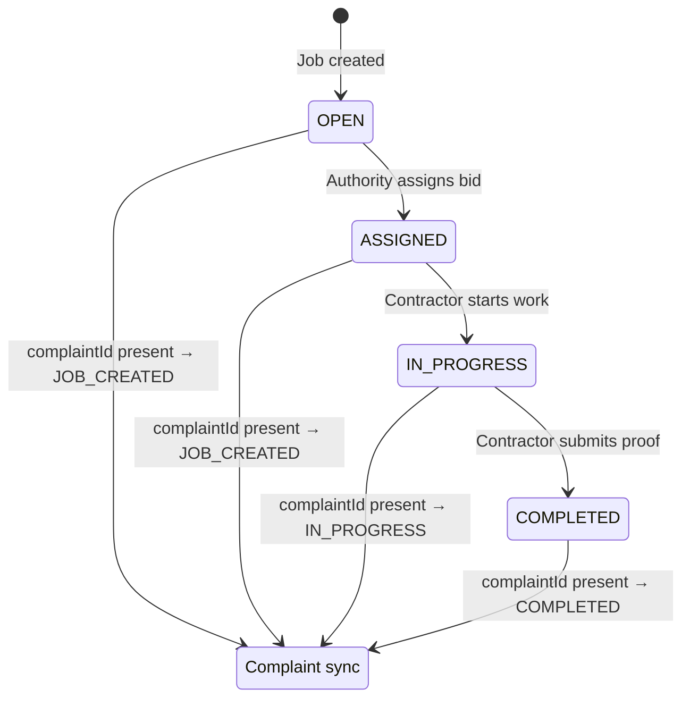

# Design Document: FixMyCity Full System

## Overview

FixMyCity is a civic issue management platform composed of three applications sharing a single Node.js/Express/Mongoose backend:

- **Authority Dashboard** — React/TypeScript/Vite app used by municipal authorities to create issues, manage jobs, assign contractors, and monitor the map
- **Contractor Dashboard** — React/TypeScript/Vite app used by contractors to discover open jobs on a map, place bids, and submit completion proof
- **Citizen App** — future mobile/web app (not yet integrated); the backend is already structured to accept citizen-submitted data without any changes

The system flow is linear: Authority creates a Job → Job appears on the map → Contractor views and bids → Authority assigns the winning bid → Contractor completes with GPS proof → Map updates in real time via 30-second polling.

The design prioritizes a **source-agnostic backend** so that the Citizen App can be plugged in later without touching any existing controller logic.

---

## Architecture

```mermaid
graph TD
    subgraph Clients
        A[Authority Dashboard<br/>React + Vite + Leaflet]
        C[Contractor Dashboard<br/>React + Vite + Leaflet]
        Z[Citizen App<br/>future]
    end

    subgraph Backend [Node.js / Express API]
        AUTH[/api/auth]
        JOBS[/api/jobs]
        BIDS[/api/bids]
        COMP[/api/complaints]
        UPLOAD[/api/upload]
        MW[JWT Auth Middleware]
    end

    subgraph Storage
        DB[(MongoDB Atlas)]
        CDN[Cloudinary CDN]
    end

    A -->|JWT Bearer| MW
    C -->|JWT Bearer| MW
    Z -->|JWT Bearer| MW
    MW --> AUTH
    MW --> JOBS
    MW --> BIDS
    MW --> COMP
    MW --> UPLOAD
    JOBS --> DB
    BIDS --> DB
    COMP --> DB
    AUTH --> DB
    UPLOAD --> CDN
```

### Key Architectural Decisions

- **Single shared backend** — both dashboards and the future Citizen App hit the same API. No separate BFF layers.
- **Source-agnostic job pipeline** — the `source` field on Job is stored but never branched on in controller logic, enabling zero-change Citizen App integration.
- **Cloudinary for media** — images are streamed from multer memory storage directly to Cloudinary; nothing is written to the local filesystem.
- **JWT authentication** — all routes except `/api/auth/*` require a valid Bearer token. Role (`ADMIN`, `CONTRACTOR`, `CITIZEN`) is embedded in the token payload.
- **Live polling** — both dashboards use `setInterval`-based 30-second polling rather than WebSockets, keeping the backend stateless.

---

## Components and Interfaces

### Backend Components

#### Auth Controller (`/api/auth`)
- `POST /api/auth/signup` — creates a User with hashed password (bcrypt, 10 rounds), returns `{ message, user }`
- `POST /api/auth/login` — verifies credentials, returns `{ token, role, userId, name }`

#### Job Controller (`/api/jobs`)
- `GET /api/jobs` — returns all jobs sorted by `createdAt` desc, with `complaintId` and `assignedTo` populated
- `POST /api/jobs` — creates a job from any source; updates linked complaint to `JOB_CREATED` if `complaintId` is present
- `GET /api/jobs/open` — returns jobs with `status: "OPEN"` only
- `POST /api/jobs/demo` — creates a job from a preset template or custom payload with `isDemoJob: true`
- `GET /api/jobs/demo/presets` — returns the 5 built-in preset templates
- `PUT /api/jobs/:id/assign` — assigns a contractor, sets job to `ASSIGNED`, accepts winning bid, rejects all others
- `PUT /api/jobs/:id/status` — updates job status; persists completion proof fields when `status: "COMPLETED"`

#### Bid Controller (`/api/bids`)
- `POST /api/bids` — creates a bid with `status: "PENDING"`; validates that the referenced job exists
- `GET /api/bids/:jobId` — returns all bids for a job with `contractorId` populated (`username`, `role`)

#### Complaint Controller (`/api/complaints`)
- `POST /api/complaints` — creates a complaint with `status: "RECEIVED"`
- `GET /api/complaints` — returns all complaints with `userId` populated
- `GET /api/complaints/:id` — returns a single complaint
- `PATCH /api/complaints/:id/status` — updates complaint status (validated against enum)

#### Upload Controller (`/api/upload`)
- `POST /api/upload` — accepts `multipart/form-data` with `image` field; streams buffer to Cloudinary via `upload_stream`; returns `{ imageUrl }`

#### Auth Middleware
- Extracts Bearer token from `Authorization` header
- Verifies with `JWT_SECRET`; attaches decoded payload to `req.user`
- Returns HTTP 401 on missing or invalid token

### Frontend Components

#### Authority Dashboard
- **Dashboard page** — stat cards (Total Issues, Active Hotspots, Completed Issues, Severity Distribution) derived from live API data
- **Jobs page** — Kanban board (OPEN / ASSIGNED / IN_PROGRESS / COMPLETED columns); bid sidebar for OPEN jobs; completion proof modal for COMPLETED jobs; Create Job modal
- **Map Dashboard page** — Leaflet map with job and complaint markers, clustering, completion lines, severity legend
- **CreateJobModal** — dual-mode (Real / Demo); real mode has full form with GPS capture and map picker; demo mode shows preset list

#### Contractor Dashboard
- **Dashboard page** — summary stats for the logged-in contractor
- **Jobs page** — list of open jobs available for bidding
- **Bids page** — contractor's submitted bids and their statuses
- **My Jobs page** — jobs assigned to the contractor; includes Complete Job action
- **Map page** — Leaflet map showing open jobs; popup with Place Bid button
- **Profile page** — contractor profile and reputation

#### Shared Utilities
- `getMarkerColor(item)` — maps severity + status to hex color; COMPLETED always returns `#10B981`
- `SEVERITY_COLORS` — constant map: `HIGH → #EF4444`, `MEDIUM → #F59E0B`, `LOW → #10B981`
- `useJobs` hook — wraps TanStack Query for job CRUD, assignment, demo creation, and 30s polling
- `useBids` hook — wraps TanStack Query for bid creation and fetching
- `useComplaints` hook — wraps TanStack Query for complaint data

---

## Data Models

### User
```
{
  username: String (required, unique)
  name: String (default: "")
  password: String (required, bcrypt hashed)
  role: enum ["CITIZEN", "ADMIN", "CONTRACTOR"] (required)
}
```

### Job
```
{
  complaintId: ObjectId → Complaint (optional)
  title: String (required)
  description: String
  category: String
  severity: enum ["LOW", "MEDIUM", "HIGH"] (default: "LOW")
  imageUrl: String
  location: { lat: Number, lng: Number, address: String }
  status: enum ["OPEN", "ASSIGNED", "IN_PROGRESS", "COMPLETED"] (default: "OPEN")
  source: String (default: "ADMIN")
  isVerified: Boolean (default: false)
  assignedTo: ObjectId → User
  completionImage: String
  completionLocation: { lat: Number, lng: Number }
  completedAt: Date
  isVerifiedCompletion: Boolean (default: false)
  isDemoJob: Boolean (default: false)
  timestamps: createdAt, updatedAt
}
```

### Bid
```
{
  jobId: ObjectId → Job (required)
  contractorId: ObjectId → User (required)
  eta: String
  cost: Number
  note: String
  status: enum ["PENDING", "ACCEPTED", "REJECTED"] (default: "PENDING")
  createdAt: Date (default: now)
}
```

### Complaint
```
{
  userId: ObjectId → User (required)
  description: String
  imageUrl: String
  category: String
  severity: enum ["LOW", "MEDIUM", "HIGH"]
  location: { lat: Number, lng: Number, address: String }
  status: enum ["RECEIVED", "JOB_CREATED", "IN_PROGRESS", "COMPLETED"] (default: "RECEIVED")
  timestamps: createdAt, updatedAt
}
```

### Status Lifecycle



---

## Correctness Properties

*A property is a characteristic or behavior that should hold true across all valid executions of a system — essentially, a formal statement about what the system should do. Properties serve as the bridge between human-readable specifications and machine-verifiable correctness guarantees.*

The frontend uses **fast-check** (already in `devDependencies` of both the frontend and backend packages). The backend uses **fast-check** with **jest** + **supertest** for API-level properties.

**Property Reflection:** After reviewing all testable criteria, the following consolidations were made:
- Requirements 5.2, 9.2, 18.1 all test the same "skip missing-location jobs" behavior → merged into Property 3
- Requirements 5.4 and 5.5 both test `getMarkerColor` → merged into Property 4 (covers all cases)
- Requirements 13.2, 13.3, 13.4 all test complaint-job status sync → merged into Property 9
- Requirements 8.1, 8.2, 8.3, 8.4 all test analytics derivation from job arrays → merged into Property 6
- Requirements 1.2 and 17.2 both test source-agnostic job creation → merged into Property 1

---

### Property 1: Job creation is source-agnostic

*For any* valid job payload, creating a job with `source: "ADMIN"` and creating an identical job with `source: "CITIZEN"` SHALL both return HTTP 201 and produce documents with identical field shapes (excluding the `source` field itself).

**Validates: Requirements 1.2, 1.4, 17.2**

---

### Property 2: Job schema defaults are always applied

*For any* job creation payload that omits optional fields, the created Job document SHALL have `status: "OPEN"`, `isVerified: false`, `isVerifiedCompletion: false`, and `isDemoJob: false` as defaults.

**Validates: Requirements 1.1**

---

### Property 3: Map markers skip jobs with missing location

*For any* collection of jobs where some have valid `location.lat`/`location.lng` and some do not, the map rendering logic SHALL produce exactly one marker for each job that has valid coordinates, and SHALL NOT throw a runtime error for jobs with missing or null location fields.

**Validates: Requirements 5.3, 9.3, 18.1**

---

### Property 4: Marker color reflects severity and completion status

*For any* job, `getMarkerColor` SHALL return `#10B981` when `status === "COMPLETED"` regardless of severity, and SHALL return `#EF4444` / `#F59E0B` / `#10B981` for HIGH / MEDIUM / LOW severity respectively when the job is not completed.

**Validates: Requirements 5.4, 5.5**

---

### Property 5: Popup description is truncated to 80 characters

*For any* job whose `description` has length greater than 80 characters, the popup HTML generated for that job's marker SHALL contain the description truncated to at most 80 characters.

**Validates: Requirements 7.1, 9.4**

---

### Property 6: Analytics counts are correctly derived from job arrays

*For any* array of jobs with arbitrary statuses and severities:
- Total count SHALL equal `jobs.length`
- Active Hotspots count SHALL equal `jobs.filter(j => j.status !== "COMPLETED").length`
- Completed count SHALL equal `jobs.filter(j => j.status === "COMPLETED").length`
- Each severity count SHALL equal `jobs.filter(j => j.severity === S).length` for S ∈ {HIGH, MEDIUM, LOW}

**Validates: Requirements 8.1, 8.2, 8.3, 8.4**

---

### Property 7: Bid creation always starts as PENDING

*For any* valid bid payload referencing an existing job, `POST /api/bids` SHALL return HTTP 201 and the created Bid document SHALL have `status: "PENDING"`.

**Validates: Requirements 10.1**

---

### Property 8: Job assignment enforces bid exclusivity

*For any* job with N bids (N ≥ 1), after `PUT /api/jobs/:id/assign` with a valid `bidId`, the job SHALL have `status: "ASSIGNED"`, exactly one Bid for that job SHALL have `status: "ACCEPTED"`, and all remaining N-1 Bids SHALL have `status: "REJECTED"`.

**Validates: Requirements 11.3, 13.5**

---

### Property 9: Job status changes sync linked complaint status

*For any* job that has a `complaintId` referencing an existing Complaint, updating the job's status to `IN_PROGRESS` or `COMPLETED` SHALL update the linked Complaint's `status` to the same value in the same request.

**Validates: Requirements 13.2, 13.3, 13.4**

---

### Property 10: Completion proof fields are fully persisted

*For any* completion payload containing `completionImage`, `completionLocation`, `completedAt`, and `isVerifiedCompletion`, a `PUT /api/jobs/:id/status` with `status: "COMPLETED"` SHALL persist all four fields on the Job document.

**Validates: Requirements 12.5**

---

### Property 11: Protected routes reject requests without a valid token

*For any* protected API route, a request made without a valid JWT Bearer token SHALL receive HTTP 401, regardless of the route method or path.

**Validates: Requirements 15.4**

---

### Property 12: Demo job creation always sets isDemoJob and status

*For any* preset index (0–4) or custom payload, `POST /api/jobs/demo` SHALL return a Job document with `isDemoJob: true` and `status: "OPEN"`.

**Validates: Requirements 16.1, 16.3**

---

### Property 13: Complaint creation round-trip preserves all fields

*For any* valid complaint payload `{ description, imageUrl, category, severity, location }`, `POST /api/complaints` SHALL return HTTP 201 and the created document SHALL contain all submitted fields with `status: "RECEIVED"`.

**Validates: Requirements 17.1**

---

### Property 14: Issue form validation blocks submission on missing required fields

*For any* form state missing at least one of `title`, `description`, or `location`, submitting the Issue_Form SHALL not invoke any API call and SHALL display a validation error.

**Validates: Requirements 2.7**

---

### Property 15: Status badges render for all Job_Status values

*For any* job with status ∈ {OPEN, ASSIGNED, IN_PROGRESS, COMPLETED}, the job card component SHALL render a visible status badge matching that status value.

**Validates: Requirements 14.1**

---

## Error Handling

### Backend

| Scenario | Response |
|---|---|
| Missing JWT token | HTTP 401 `{ error: "No token" }` |
| Invalid/expired JWT | HTTP 401 `{ error: "Invalid token" }` |
| POST /api/upload without image | HTTP 400 `{ error: "No image provided" }` |
| POST /api/bids with non-existent jobId | HTTP 404 `{ error: "Job not found" }` |
| PUT /api/jobs/:id/assign with non-existent contractorId | HTTP 404 `{ error: "Contractor not found" }` |
| GET /api/complaints/:id not found | HTTP 404 `{ error: "Complaint not found" }` |
| PATCH /api/complaints/:id/status with invalid status | HTTP 400 `{ error: "status must be one of: ..." }` |
| Any unhandled server error | HTTP 500 `{ error: "<message>" }` |

### Frontend

- **API fetch failure** — both dashboards catch errors in their hooks and expose an `error` string; pages render an error banner instead of crashing
- **Upload failure** — `CreateJobModal` shows an error toast and does not proceed to job creation
- **GPS denied** — shows an error toast instructing the user to set location manually via the map picker
- **GPS denied during completion** — shows an error toast and blocks completion submission
- **Map component unmount** — `useEffect` cleanup calls `mapInstance.remove()` to prevent Leaflet memory leaks
- **Jobs with missing location** — map rendering skips those jobs with a guard (`if (!job.location?.lat || !job.location?.lng) return`)

---

## Testing Strategy

### Unit Tests (example-based)

Focus on specific behaviors and edge cases:

- Auth controller: signup with missing fields returns 400; login with wrong password returns 400
- Upload route: POST without file returns 400
- Bid controller: POST with non-existent jobId returns 404
- Job controller: assign with non-existent contractorId returns 404
- `getMarkerColor` utility: specific inputs produce expected colors
- `CreateJobModal`: renders all required form fields; GPS button triggers geolocation; image preview appears after file selection
- Map dashboard: loading state renders; error state renders without crash; map cleanup on unmount
- Status badges: each status value renders the correct badge class

### Property-Based Tests (fast-check)

Each property test runs a minimum of **100 iterations**. Tests are tagged with the format:
`// Feature: fixmycity-full-system, Property N: <property text>`

**Backend properties** (Jest + Supertest + fast-check, in-memory MongoDB via `mongodb-memory-server`):
- Property 1: Source-agnostic job creation
- Property 2: Job schema defaults
- Property 7: Bid creation always PENDING
- Property 8: Assignment bid exclusivity
- Property 9: Complaint status sync
- Property 10: Completion proof persistence
- Property 11: Protected route 401 enforcement
- Property 12: Demo job isDemoJob + status
- Property 13: Complaint creation round-trip

**Frontend properties** (Vitest + @testing-library/react + fast-check):
- Property 3: Map skips missing-location jobs
- Property 4: Marker color mapping
- Property 5: Popup description truncation
- Property 6: Analytics count derivation
- Property 14: Form validation blocks API calls
- Property 15: Status badge rendering

### Integration Tests

- Full job lifecycle: create → bid → assign → complete, verifying all status transitions and complaint sync
- Image upload: POST a real image buffer to the upload route and verify a Cloudinary URL is returned
- Marker clustering: verify `leaflet.markercluster` is loaded and markers are added to a cluster group

### Smoke Tests

- All protected routes return 401 without a token
- `POST /api/auth/signup` and `POST /api/auth/login` are accessible without a token
- MongoDB connection uses `process.env.MONGO_URI`
- Multer is configured with `memoryStorage()` (no disk writes)
- No `if (source === "ADMIN")` or `if (source === "CITIZEN")` branches exist in `jobController.js`
- No hardcoded data arrays in production code paths
