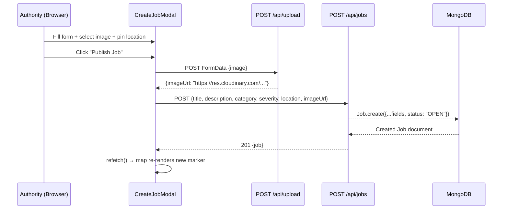
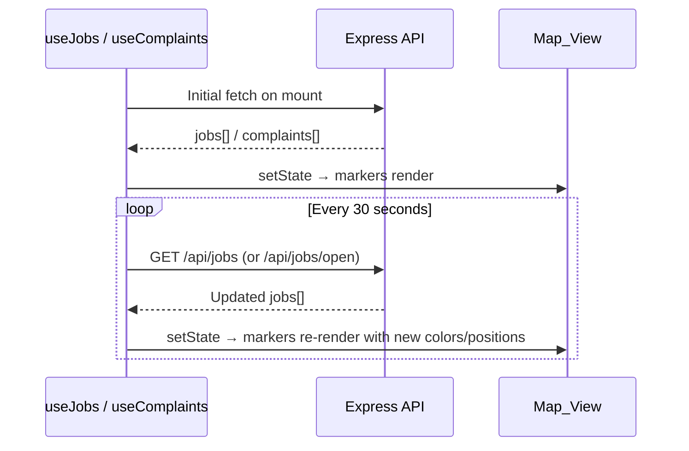

# Design Document — fixmycity-map-jobs

## Overview

This feature upgrades the FixMyCity civic platform from a demo-only job system to a fully interactive, real-time job management platform. The work spans both the Authority Portal and Contractor Portal frontends (React/TypeScript/Vite) and the shared Express/Mongoose backend.

Key capabilities added:
- Real job creation with image upload (Cloudinary) and GPS/map-pin location selection
- Live Leaflet map on both portals showing severity-colored hotspot markers with clustering
- Completion location visualization with dashed polylines connecting issue and resolution sites
- 30-second live polling for real-time data freshness
- Authority dashboard analytics derived entirely from live API data

No mock or hardcoded data is used in any production code path.

---

## Architecture

The system follows the existing three-tier architecture: React SPA frontends → Express REST API → MongoDB via Mongoose.

```mermaid
graph TD
    subgraph Authority Portal [Authority Portal - React/Vite]
        AP_Dashboard[Dashboard Page]
        AP_Map[MapDashboard Page]
        AP_Modal[CreateJobModal]
        AP_useJobs[useJobs hook]
        AP_useComplaints[useComplaints hook]
    end

    subgraph Contractor Portal [Contractor Portal - React/Vite]
        CP_Map[ContractorMapPage - NEW]
        CP_Jobs[Jobs Page]
        CP_useJobs[contractor/useJobs hook]
    end

    subgraph Backend [Backend - Express/Node.js]
        JR[/api/jobs routes]
        JC[jobController]
        UR[/api/upload routes]
        UC[uploadController]
        CR[/api/complaints routes]
    end

    subgraph DB [MongoDB]
        JobCol[(Job collection)]
        ComplaintCol[(Complaint collection)]
        UserCol[(User collection)]
    end

    subgraph External
        Cloudinary[Cloudinary CDN]
        Leaflet[Leaflet + MarkerCluster]
    end

    AP_useJobs -->|GET /api/jobs| JR
    AP_useComplaints -->|GET /api/complaints| CR
    AP_Modal -->|POST /api/upload| UR
    AP_Modal -->|POST /api/jobs| JR
    CP_useJobs -->|GET /api/jobs/open| JR
    JR --> JC
    JC --> JobCol
    UR --> UC
    UC --> Cloudinary
    CR --> ComplaintCol
    AP_Map --> Leaflet
    CP_Map --> Leaflet
```

### Data Flow — Job Creation



### Live Poll Cycle



---

## Components and Interfaces

### Backend

#### `jobController.js` — additions / changes

| Function | Method | Route | Change |
|---|---|---|---|
| `createJob` | POST | `/api/jobs` | Already accepts `imageUrl`, `location` — no change needed |
| `updateJobStatus` | PUT | `/api/jobs/:id/status` | Already persists `completionImage`, `completionLocation` — no change needed |
| `getJobs` | GET | `/api/jobs` | Already returns full documents — no change needed |
| `getOpenJobs` | GET | `/api/jobs/open` | Already filters `status: "OPEN"` — no change needed |

The backend is already complete for all requirements. No new routes or controller functions are needed.

#### `uploadRoutes.js` — existing

Accepts `multipart/form-data` with field `image`, uploads to Cloudinary via multer memory storage, returns `{ imageUrl }`. Already implemented.

---

### Frontend — Authority Portal

#### `CreateJobModal` (existing, extend)

Current state: supports Real Job mode and Demo mode via toggle. The real job form already has all required fields (title, description, category, severity, image upload, GPS button, Leaflet map picker). The component is functionally complete per requirements 1–4.

**Gaps to close:**
- Validation error display (req 1.3): currently uses `toast.error` — this satisfies the requirement.
- Image preview (req 2.2): already implemented via `setPreview(URL.createObjectURL(file))`.
- Upload-then-create sequencing (req 2.3): already implemented in `handleSubmit`.
- GPS loading indicator (req 3.4): already implemented via `gpsLoading` state.
- Map picker coordinate overlay (req 4.4): already implemented.

No structural changes needed to `CreateJobModal`.

#### `MapDashboard.tsx` (existing, extend)

Current state: renders jobs and complaints on a Leaflet map with clustering, severity colors, pulse animation for HIGH severity, completion markers, and dashed polylines. Live polling is handled by `useJobs` and `useComplaints` hooks.

**Gaps to close:**
- Legend (req 6.4): add a visible legend card showing HIGH/MEDIUM/LOW colors and labels. The current legend shows counts but not the color-to-severity mapping explicitly.
- Error state (req 14.4): add error display when `useJobs` or `useComplaints` returns an error.

#### `Dashboard.tsx` (existing, extend)

**Gaps to close (req 13):**
- Add "Total Issues" stat card showing `jobs.length`.
- Add "Active Hotspots" stat card showing `jobs.filter(j => j.status !== "COMPLETED").length`.
- Add "Completed Issues" stat card showing `jobs.filter(j => j.status === "COMPLETED").length`.
- Add "Severity Distribution" breakdown (HIGH/MEDIUM/LOW counts).

All values derived from `useJobs()` — no hardcoded data.

#### `useJobs.ts` (existing)

Already implements:
- `fetchJobs` with 30-second polling interval
- `createJob`, `uploadImage`, `updateJobStatus`, `assignJob`
- `jobsByCategory`, `completionRate` analytics helpers

**Additions needed:**
- `jobsBySeverity` computed property: `{ HIGH: number, MEDIUM: number, LOW: number }`
- `totalIssues`, `activeHotspots`, `completedIssues` computed properties for dashboard analytics

---

### Frontend — Contractor Portal

#### `ContractorMapPage` (NEW — `src/pages/contractor/MapPage.tsx`)

A new page added to the contractor portal at route `/contractor/app/map`.

**Responsibilities:**
- Fetch open jobs from `GET /api/jobs/open` via the contractor `useJobs` hook (already polls every 30s)
- Render a Leaflet map with one `Hotspot_Marker` per open job using the same severity color system
- On marker click: show popup with `title`, `description` (truncated 80 chars), `severity`, `location.address`, and a "Place Bid" button
- On "Place Bid" click: open the existing bid submission modal pre-filled with the selected job
- Display loading state while data is fetching
- Clean up Leaflet instance on unmount

**Route registration** — add to `App.tsx`:
```tsx
<Route path="/contractor/app/map" element={
  <ContractorProtectedRoute>
    <ContractorLayout><ContractorMapPage /></ContractorLayout>
  </ContractorProtectedRoute>
} />
```

**Sidebar link** — add "Map" nav item to `ContractorLayout` sidebar.

#### `contractor/useJobs.ts` (existing)

Already fetches open jobs with 30-second polling. No changes needed.

---

## Data Models

### Job (MongoDB — `backend/models/Job.js`)

The existing schema already satisfies all requirements. Documented here for completeness:

```typescript
interface Job {
  _id: ObjectId;
  complaintId?: ObjectId;          // ref: Complaint (optional)
  title: string;                   // required
  description?: string;
  category?: string;
  severity: "LOW" | "MEDIUM" | "HIGH";  // default: "LOW"
  imageUrl?: string;               // Cloudinary URL
  status: "OPEN" | "ASSIGNED" | "IN_PROGRESS" | "COMPLETED";  // default: "OPEN"
  location?: {
    lat: number;
    lng: number;
    address?: string;
  };
  assignedTo?: ObjectId;           // ref: User
  completionImage?: string;        // Cloudinary URL
  completionLocation?: {
    lat: number;
    lng: number;
  };
  isDemoJob: boolean;              // default: false
  createdAt: Date;
  updatedAt: Date;
}
```

No schema changes required.

### Complaint (MongoDB — `backend/models/Complaint.js`)

```typescript
interface Complaint {
  _id: ObjectId;
  userId: ObjectId;                // ref: User
  description?: string;
  imageUrl?: string;
  category?: string;
  severity: "LOW" | "MEDIUM" | "HIGH";
  location?: {
    lat: number;
    lng: number;
    address?: string;
  };
  status: "RECEIVED" | "JOB_CREATED" | "IN_PROGRESS" | "COMPLETED";
  createdAt: Date;
  updatedAt: Date;
}
```

No schema changes required.

### Frontend TypeScript Interfaces

```typescript
// Existing in useJobs.ts — no changes needed
interface Job {
  _id: string;
  complaintId?: { _id: string; description: string; category: string; imageUrl?: string };
  title: string;
  description: string;
  category: string;
  severity: string;
  location: { lat: number; lng: number; address: string };
  status: "OPEN" | "ASSIGNED" | "IN_PROGRESS" | "COMPLETED";
  assignedTo?: { _id: string; username: string; role: string };
  completionImage?: string;
  completionLocation?: { lat: number; lng: number };
  isDemoJob?: boolean;
  imageUrl?: string;
  createdAt: string;
}

// New computed analytics shape (added to useJobs return)
interface JobAnalytics {
  totalIssues: number;
  activeHotspots: number;
  completedIssues: number;
  jobsBySeverity: { HIGH: number; MEDIUM: number; LOW: number };
}
```

---

## API Contracts

All existing endpoints satisfy the requirements. Documented here for reference:

### `POST /api/jobs`
**Auth:** Bearer token required  
**Body:**
```json
{
  "title": "string (required)",
  "description": "string",
  "category": "string",
  "severity": "LOW | MEDIUM | HIGH",
  "location": { "lat": 18.52, "lng": 73.85, "address": "string" },
  "imageUrl": "string (optional)",
  "complaintId": "ObjectId (optional)"
}
```
**Response 201:**
```json
{
  "_id": "...",
  "title": "...",
  "status": "OPEN",
  "location": { "lat": 18.52, "lng": 73.85, "address": "..." },
  "imageUrl": "https://res.cloudinary.com/...",
  "severity": "HIGH",
  "isDemoJob": false,
  "createdAt": "2024-01-01T00:00:00.000Z"
}
```

### `GET /api/jobs`
**Auth:** Bearer token required  
**Response 200:** Array of Job documents, sorted by `createdAt` descending, with `complaintId` and `assignedTo` populated.

### `GET /api/jobs/open`
**Auth:** Bearer token required  
**Response 200:** Array of Job documents where `status === "OPEN"`, sorted by `createdAt` descending.

### `PUT /api/jobs/:id/status`
**Auth:** Bearer token required  
**Body:**
```json
{
  "status": "OPEN | ASSIGNED | IN_PROGRESS | COMPLETED",
  "completionImage": "string (optional, used when status=COMPLETED)",
  "completionLocation": { "lat": 18.52, "lng": 73.85 }
}
```
**Response 200:** Updated Job document.

### `POST /api/upload`
**Auth:** Bearer token required  
**Body:** `multipart/form-data` with field `image` (PNG/JPG/WEBP, max 5MB)  
**Response 200:**
```json
{ "imageUrl": "https://res.cloudinary.com/..." }
```

### `GET /api/complaints`
**Auth:** Bearer token required  
**Response 200:** Array of Complaint documents.

---

## Hotspot Color System

The severity-to-color mapping is a shared constant used across both portals and must be consistent:

```typescript
const SEVERITY_COLORS: Record<string, string> = {
  HIGH:   "#EF4444",  // red
  MEDIUM: "#F59E0B",  // yellow/amber
  LOW:    "#10B981",  // green
};

const COMPLETED_COLOR = "#10B981"; // always green, overrides severity

function getMarkerColor(job: Job): string {
  if (job.status === "COMPLETED") return COMPLETED_COLOR;
  return SEVERITY_COLORS[job.severity] ?? "#3B82F6";
}
```

Pulse animation applies only when `severity === "HIGH"` and `status !== "COMPLETED"`:

```css
@keyframes pulseMarker {
  0%   { box-shadow: 0 0 0 0 rgba(239, 68, 68, 0.7); }
  70%  { box-shadow: 0 0 0 15px rgba(239, 68, 68, 0); }
  100% { box-shadow: 0 0 0 0 rgba(239, 68, 68, 0); }
}
```

---

## Correctness Properties

*A property is a characteristic or behavior that should hold true across all valid executions of a system — essentially, a formal statement about what the system should do. Properties serve as the bridge between human-readable specifications and machine-verifiable correctness guarantees.*

### Property 1: Job creation persists all submitted fields

*For any* valid job payload (with random title, description, category, severity, location, and imageUrl), POSTing to `/api/jobs` SHALL return a document where `status` is `"OPEN"` and all submitted fields are present and equal to the submitted values.

**Validates: Requirements 1.2, 12.1, 12.2**

---

### Property 2: Required field validation rejects incomplete payloads

*For any* job payload missing one or more of `title`, `description`, or `location`, the Job_Form SHALL reject the submission without calling the API, and the job list SHALL remain unchanged.

**Validates: Requirements 1.3**

---

### Property 3: GPS coordinate capture updates location state

*For any* valid GPS coordinate pair `(lat, lng)`, when `navigator.geolocation.getCurrentPosition` resolves with those coordinates, the Job_Form location state SHALL be updated to exactly `{ lat, lng }`.

**Validates: Requirements 3.2**

---

### Property 4: Map interaction updates location state

*For any* coordinate pair `(lat, lng)` produced by a map click or pin drag event, the Job_Form location state SHALL be updated to exactly `{ lat, lng }`, and the coordinate overlay SHALL display those values.

**Validates: Requirements 4.2, 4.3, 4.4**

---

### Property 5: Marker count equals valid-location record count

*For any* array of jobs and complaints, the number of markers rendered on the Map_View SHALL equal the number of records that have both a non-null `location.lat` and a non-null `location.lng`. Records with missing location fields SHALL be silently skipped without throwing a runtime error.

**Validates: Requirements 5.2, 5.3, 5.4, 14.1**

---

### Property 6: Marker color reflects severity and completion status

*For any* job, the color of its Hotspot_Marker SHALL be `#10B981` if `status === "COMPLETED"`, `#EF4444` if `severity === "HIGH"`, `#F59E0B` if `severity === "MEDIUM"`, and `#10B981` if `severity === "LOW"`. The completed-status color overrides severity.

**Validates: Requirements 6.1, 6.2**

---

### Property 7: HIGH severity non-completed jobs have pulse animation

*For any* job where `severity === "HIGH"` and `status !== "COMPLETED"`, the Hotspot_Marker HTML SHALL contain the `pulseMarker` CSS animation. *For any* job where `status === "COMPLETED"` or `severity !== "HIGH"`, the pulse animation SHALL NOT be applied.

**Validates: Requirements 6.3**

---

### Property 8: Job popup contains all required fields

*For any* job with a Hotspot_Marker, clicking the marker SHALL produce a popup whose HTML contains the job's `title`, a truncated (≤80 chars) form of `description`, the `severity` value, and the `status` value. If `imageUrl` is present, the popup SHALL also contain an `` element with that URL as `src`.

**Validates: Requirements 8.1**

---

### Property 9: Completion visualization for completed jobs with location

*For any* job where `status === "COMPLETED"` and `completionLocation.lat` is a valid number, the Map_View SHALL render a Completion_Marker at `(completionLocation.lat, completionLocation.lng)` AND draw a dashed green polyline connecting `(location.lat, location.lng)` to `(completionLocation.lat, completionLocation.lng)`.

**Validates: Requirements 10.1, 10.3**

---

### Property 10: Completion marker popup contains resolution proof

*For any* completed job with a `completionImage`, clicking the Completion_Marker SHALL produce a popup whose HTML contains the text "Resolution Proof" and an `` element with `completionImage` as `src`.

**Validates: Requirements 10.4**

---

### Property 11: Dashboard analytics match live job data

*For any* array of jobs returned by the API, the Authority Dashboard SHALL display:
- "Total Issues" equal to `jobs.length`
- "Active Hotspots" equal to `jobs.filter(j => j.status !== "COMPLETED").length`
- "Completed Issues" equal to `jobs.filter(j => j.status === "COMPLETED").length`
- Severity distribution counts equal to the actual count of HIGH, MEDIUM, and LOW severity jobs in the array

**Validates: Requirements 13.1, 13.2, 13.3, 13.4**

---

### Property 12: Completion proof fields are persisted on status update

*For any* job updated to `status: "COMPLETED"` with a `completionLocation` and/or `completionImage`, a subsequent `GET /api/jobs` SHALL return that job with `completionLocation` and `completionImage` equal to the submitted values.

**Validates: Requirements 12.3, 12.4**

---

### Property 13: API error does not crash the Map_View

*For any* API failure (network error, 4xx, 5xx) on the jobs or complaints fetch, the Map_View SHALL remain mounted, SHALL display an error message, and SHALL NOT throw an unhandled exception.

**Validates: Requirements 14.4**

---

## Error Handling

| Scenario | Handling |
|---|---|
| Image upload fails (`/api/upload` returns error) | `toast.error` shown; job creation does not proceed (req 2.4) |
| GPS permission denied | `toast.error` instructing manual map pin; GPS loading indicator cleared (req 3.3) |
| GPS timeout | Same as permission denied |
| Job creation API fails | `toast.error` with server error message; form remains open |
| Map data fetch fails | Error state set in hook; Map_View renders error message instead of map (req 14.4) |
| Job/complaint missing `location` | Marker skipped silently; no `console.error` or thrown exception (req 5.4, 14.1) |
| Leaflet script/CSS load failure | Map container shows fallback text; no crash |
| Component unmount during async operation | `isMounted` flag pattern prevents state updates on unmounted components (req 14.5) |

---

## Testing Strategy

### Unit Tests (example-based)

Focus on specific behaviors and edge cases:

- `CreateJobModal` renders all required form fields (req 1.1)
- Mode toggle switches between Real and Demo modes (req 1.4)
- File input accepts PNG/JPG/WEBP MIME types (req 2.1)
- Upload-then-create sequencing: upload called before job creation (req 2.3)
- GPS loading indicator shown during geolocation request (req 3.4)
- Map picker renders with default Pune coordinates (req 4.1)
- Legend renders with all three severity/color pairs (req 6.4)
- Cluster group is used when adding markers (req 7.1)
- Popup uses dark background CSS class (req 8.2)
- Contractor map page fetches from `/api/jobs/open` on mount (req 9.1)
- "Place Bid" click opens bid modal pre-filled with selected job (req 9.4)
- Completion marker icon differs from hotspot marker icon (req 10.2)
- `refetch()` is called immediately after job creation (req 11.2)
- Loading indicator shown before data arrives (req 11.4, 14.2)
- Map `remove()` called on component unmount (req 14.5)

### Property-Based Tests

Using **fast-check** (TypeScript-native PBT library). Each test runs a minimum of 100 iterations.

**Tag format:** `// Feature: fixmycity-map-jobs, Property {N}: {property_text}`

| Property | Test Description |
|---|---|
| P1 | Arbitrary valid job payloads → POST → response has `status: "OPEN"` and all fields match |
| P2 | Arbitrary payloads missing required fields → form rejects without API call |
| P3 | Arbitrary `(lat, lng)` from mock geolocation → location state equals those values |
| P4 | Arbitrary map click/drag coordinates → location state and overlay text match |
| P5 | Arbitrary job/complaint arrays with mixed valid/invalid locations → marker count equals valid-location count |
| P6 | Arbitrary jobs with any severity/status combination → `getMarkerColor()` returns correct color |
| P7 | Arbitrary HIGH non-completed jobs → pulse animation present; arbitrary completed/non-HIGH jobs → pulse absent |
| P8 | Arbitrary jobs with various field combinations → popup HTML contains all required fields |
| P9 | Arbitrary completed jobs with `completionLocation` → completion marker and polyline rendered |
| P10 | Arbitrary completed jobs with `completionImage` → popup contains "Resolution Proof" and image |
| P11 | Arbitrary job arrays → dashboard stat values match computed values from the same array |
| P12 | Arbitrary `completionLocation`/`completionImage` values → round-trip through PUT then GET returns same values |
| P13 | Arbitrary API error responses → Map_View remains mounted and shows error message |

### Integration Tests

- `GET /api/jobs` returns all jobs with populated `complaintId` and `assignedTo` fields
- `POST /api/jobs` → `GET /api/jobs/:id` round-trip preserves all fields
- `PUT /api/jobs/:id/status` with `COMPLETED` + completion data → fields persisted
- `POST /api/upload` with valid image → returns Cloudinary URL
- Marker cluster groups nearby markers (2–3 examples with known coordinates)
